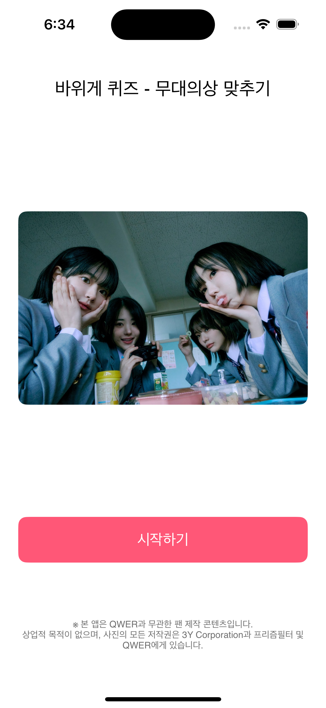
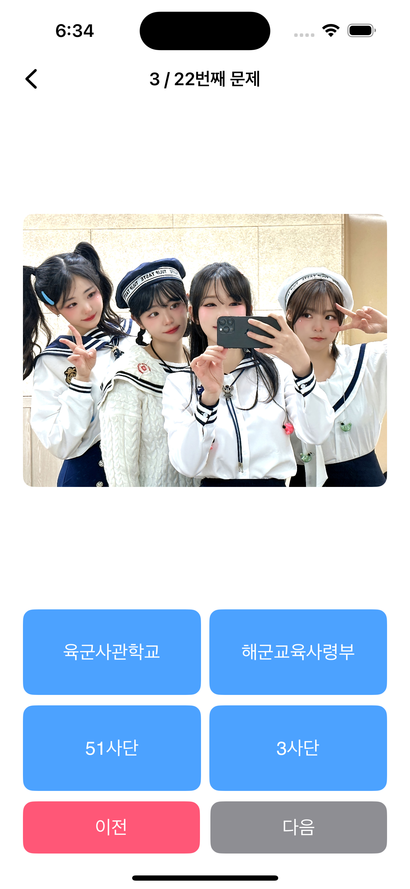
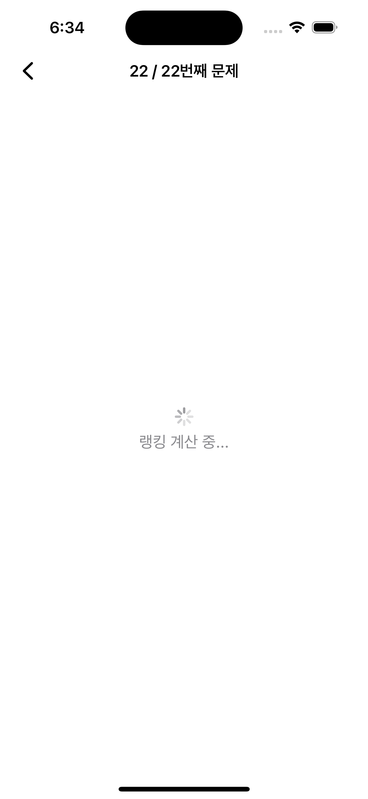
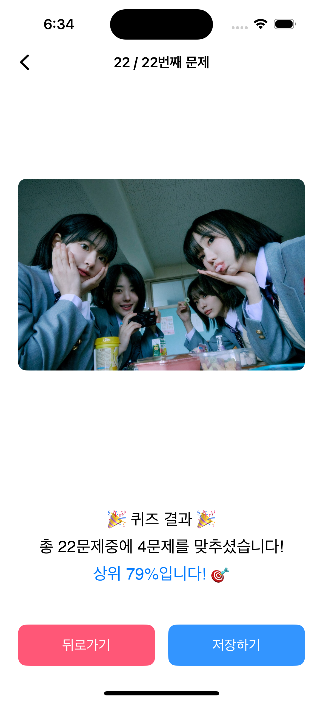
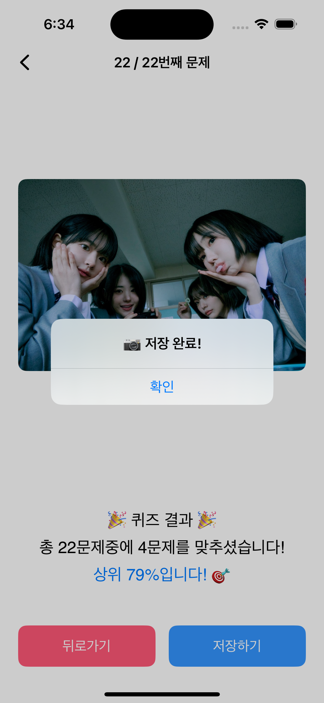
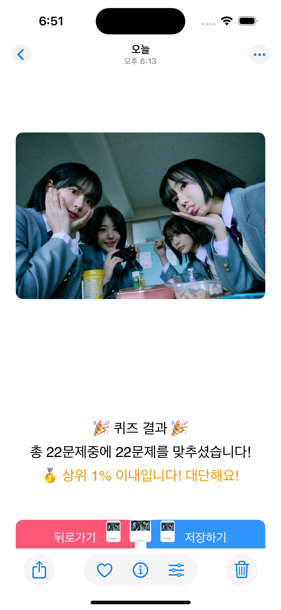

# 🎯 RockCrabQuiz

[](LICENSE)
[]
[]

---

## 📖 소개

`RockCrabQuiz`는 **QWER** 팬(바위게)들을 위한 **팬메이드 아이템 맞추기 퀴즈 앱**입니다.
SwiftUI와 Firebase Analytics 기반으로 제작되었습니다.

---

## ✨ 주요 기능

- 문제 풀기 (4지선다) ✅  
- 이전/다음 내비게이션  
- Firebase 이벤트 기반 분석:  
  - `quiz_start`, `question_answered`, `question_navigated`, `quiz_finished`, `screenshot_saved`  
- 퀴즈 결과값 스크린샷 저장  
- TestFlight 통한 내부/외부 배포 준비중

---

## 📸 데모 스크린샷

## 📱 앱 화면 미리보기

<p align="center">
  
  
  
  
  
  
  
  
</p>

---

## 🚀 시작하기

1. 이 저장소 클론  
   ```bash
   git clone https://github.com/YuSeongChoi/RockCrabCalendar.git
   cd RockCrabCalendar
   ```
2.	RockTurtleQuiz.xcodeproj / .xcworkspace 열기
3.	Xcode에서 Signing & Capabilities → Team 설정
4.	기기 또는 시뮬레이터에서 실행
